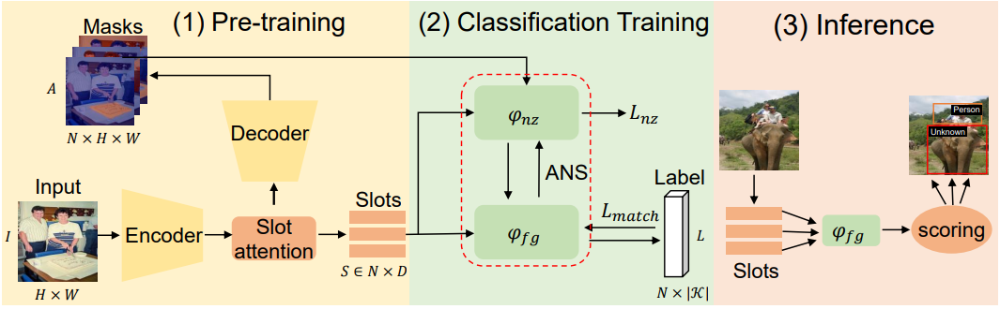
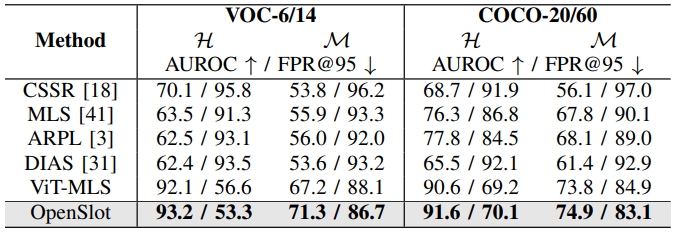
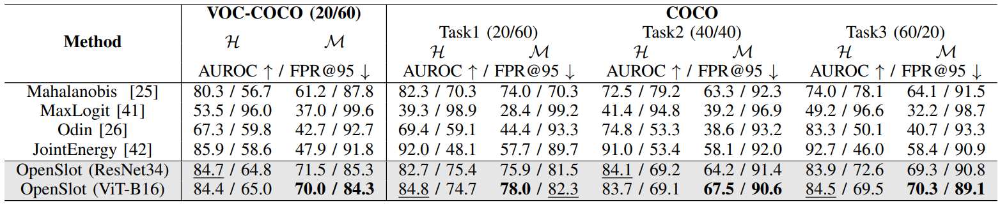

# OpenSlot: Mixed Open-Set Recognition with Object-Centric Learning

<div align="center">
    <p><i>Official implementation of our IEEE Transaction on Multimedia (TMM)'24 paper</i></p>
    <p><b><a href="https://arxiv.org/pdf/2407.02386">Object-centric Open-set Recognition</a></b></p>
</div>

## Introduction

<div align="center">
    
</div>

OpenSlot is a framework designed to perform open-set recognition (OSR) based on object-centric representations (i.e., slot) in the multi-label and mixed conditions. It consists of:

1) **Object-Centric Pretraining**: Train all known classes through [Dinosaur](https://github.com/amazon-science/object-centric-learning-framework/tree/main) to obtain the slot representation.

2) **Classification Fine-tuning**: Exclude noise slot features from the classification training through our proposed ANS technique.

3) **Inference**: Score slot predictions to conduct OSR evaluation.

## Installation and Usage

### Pre-training
Set up the Dinosaur development environment using [poetry](https://python-poetry.org/docs/#installation):
```bash
cd object-centric-learning-framework
poetry install
```

Download and prepare datasets:
```bash
# Download datasets
scripts/download_and_convert.sh

# Convert datasets to required format
python scripts/datasets/convert_xxx.py
```

Run pre-training:
```bash
poetry run ocl_train +experiment=dinosaur/intra_coco_task_xxx
```

### Classification Fine-tuning
Specify the path of pre-training checkpoints in `../configs/exp.yaml` and run:
```bash
cd .. && python train.py  # Run training experiment
```

### Inference
Conduct OSR evaluation:
```bash
python evaluation.py
```

We provide various scoring functions, including:
- [MLS](https://github.com/sgvaze/osr_closed_set_all_you_need) 
- [Energy](https://github.com/wetliu/energy_ood)
- [JointEnergy](https://github.com/deeplearning-wisc/multi-label-ood)
- [Mahalanobis distance](https://github.com/pokaxpoka/deep_Mahalanobis_detector)

More scoring metric can be found in [OpenOOD](https://github.com/Jingkang50/OpenOOD)

## Results

<div align="center">
    <p><b>Mixed OSR performance comparison on single- and multi-label datasets:</b></p>
    
    
</div>

## Acknowledgements
This code is built upon [Dinosaur](https://github.com/amazon-science/object-centric-learning-framework/tree/main). Thanks to Maximilian Seitzer for their contribution.


## Citation
If you find this work useful for your research, please cite our paper:
```
@article{yin2024openslot,
  title={OpenSlot: Mixed Open-set Recognition with Object-centric Learning},
  author={Yin, Xu and Pan, Fei and An, Guoyuan and Huo, Yuchi and Xie, Zixuan and Yoon, Sung-Eui},
  journal={arXiv preprint arXiv:2407.02386},
  year={2024}
}
```